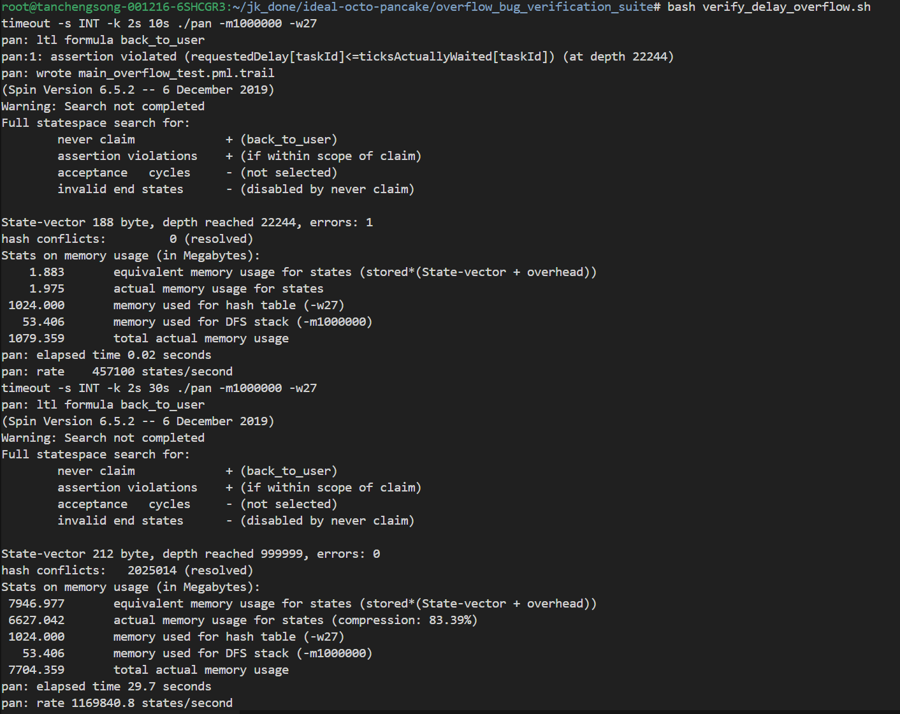

# Overflow Bug Verification Suite

## 概述

本验证套件用于演示和验证 LiteOS-M 任务延迟（Task Delay）中的**字节溢出 Bug** 及其修复方案。

### Bug 描述

当系统时钟计数器 `g_tickCount` 接近 255 时，如果任务调用 `LOS_TaskDelay(ticks)`，计算唤醒时间时会发生字节溢出：

```c
byte wakeupTime = g_tickCount + ticks;  // Bug: 当 g_tickCount + ticks >= 256 时溢出
```

**示例场景：**

1. **初始状态**：`g_tickCount = 250`
2. **任务调用延迟**：任务调用 `LOS_TaskDelay(10)`
3. **进入 `OsSchedDelay()`**：
   - 计算唤醒时间：`byte wakeupTime = g_tickCount + ticks`，即 `250 + 10 = 260`
   - 由于 `wakeupTime` 是 `byte` 类型（0-255），发生溢出：`260 % 256 = 4`
   - 调用排序插入逻辑，比较 `wakeupTime (4) < g_taskSortLink[i].responseTime`
   - 由于 `4` 小于队列中大多数任务的 `responseTime`，该任务被**错误地插入到队列前端**
4. **下一次 `OsTickProcess()` 执行**：
   - `g_tickCount` 递增（仍为 251）
   - 检查条件：`g_tickCount (251) >= taskResponseTime (4)` 为 **TRUE**
   - 断言 `assert(requestedDelay[taskId] <= ticksActuallyWaited[taskId])` 被触发
   - 此时 `requestedDelay = 10`，`ticksActuallyWaited = 1`，断言失败：`10 <= 1` 为假
5. **错误结果**：任务仅等待了 1 个 tick 就被唤醒，而非请求的 10 个 tick
6. **正确行为**：任务应在 `g_tickCount` 从 250 递增 10 次后（经过 255→0 回绕，到达 4）才被唤醒

### 修复方案

使用**双队列系统**（Dual-Queue System）：
1. **正常队列** (`g_taskSortLink`)：存储唤醒时间 >= `g_tickCount` 的任务
2. **溢出队列** (`overflowedSortLink`)：存储唤醒时间 < `g_tickCount` 的任务（表示跨越 255->0 边界）
3. 当 `g_tickCount` 从 255 回绕到 0 时，将溢出队列合并到正常队列

## 文件结构

### 核心模型文件

- **`macros.pml`**: 基础宏定义（中断控制、执行条件等）
- **`data_structures.pml`**: 数据结构和队列操作（包含修复后的双队列逻辑）
- **`ltl_properties.pml`**: LTL 性质定义

### 调度器实现

- **`bad_scheduler.pml`**: **Bug 版本** - 不含 overflow 队列处理，会触发 bug
- **`correct_scheduler.pml`**: **正确版本** - 包含完整的双队列 overflow 处理

### 测试场景

- **`processes_delay_overflow_test.pml`**: 专门设计用于触发 overflow bug 的测试进程
  - 使用 `select(initial_tick : 0 .. 255)` 非确定性选择 `g_tickCount` 初始值
  - SPIN 会自动探索所有 256 个可能的初始值，找出触发 Bug 的场景
  - 使用全范围不会增加 State-vector 大小，仅增加搜索深度
  - 包含 IdleTask 防止系统死锁

### 模型入口
我们有两个模型入口`pml`文件，用于选取不同文件验证不同侧重点的性质。其中，
- **`main_overflow_test.pml`**: 使用 `bad_scheduler.pml` 的主模型（应触发断言失败）
- **`main_correct.pml`**: 使用 `correct_scheduler.pml` 的主模型（应无错误）
该文件包含完整的 LTL 性质定义，用于进行时序逻辑验证，是检测修复方案有效性的核心模型。


## 关键验证点

### 1. 延迟正确性断言

位于 `bad_scheduler.pml` 和 `correct_scheduler.pml` 的 `OsTickProcess()` 中：

```promela
assert(requestedDelay[taskId] <= ticksActuallyWaited[taskId]);
```

**含义：**任务实际等待的 tick 数必须 >= 请求的延迟 tick 数

**Bug 场景：**
- 任务请求延迟 10 ticks (`requestedDelay[taskId] = 10`)
- 由于溢出立即唤醒 (`ticksActuallyWaited[taskId] = 0`)
- 断言失败：`10 <= 0` 为假

### 2. 状态一致性

位于 `bad_scheduler.pml` 的 `OsSchedDelay()` 函数入口处：

```promela
inline OsSchedDelay(taskID, ticks, needSched)
{
    assert(tcb[taskID].state == READY || tcb[taskID].state == RUNNING);
    needSched = 1;
    if
    :: (tcb[taskID].state == READY) ->
        OsDequeueWithId(taskID);  /* Remove from ready queue */
    :: else -> skip  /* If RUNNING, will be handled by PendSV */
    fi;
    tcb[taskID].state = DELAYED;
    // ...
}
```

这个断言确保只有处于 `READY` 或 `RUNNING` 状态的任务才能调用延迟函数。如果一个已经处于 `DELAYED` 或 `SUSPENDED` 状态的任务尝试再次延迟，说明调度逻辑存在错误，断言会立即失败并终止验证。
### 验证脚本

- **`verify_delay_overflow.sh`**: 自动化双模型对比验证脚本，执行以下步骤：
  1. 编译 Bug 模型：`spin -a main_overflow_test.pml` 生成 `pan.c`
  2. 构建验证器：`gcc -O2 -o pan pan.c`
  3. 运行验证：`timeout 10s ./pan -m1000000 -w27`（预期触发断言失败）
  4. 编译正确模型：`spin -a main_correct.pml` 生成 `pan.c`
  5. 构建验证器：`gcc -O2 -o pan pan.c`
  6. 运行验证：`timeout 30s ./pan -m1000000 -w27`（预期无错误）

运行结果截图：


## 验证方法

### 自动验证（推荐）

运行验证脚本：

```bash
bash verify_delay_overflow.sh
```

### 手动验证与预期输出

#### 1. 验证 Bug 模型

```bash
spin -a main_overflow_test.pml
gcc -O2 -o pan pan.c
./pan -m10000
```

**实际输出（Bug 复现）：**
```
timeout -s INT -k 2s 10s ./pan -m1000000 -w27
pan: ltl formula back_to_user
pan:1: assertion violated (requestedDelay[taskId]<=ticksActuallyWaited[taskId]) (at depth 22244)
pan: wrote main_overflow_test.pml.trail
(Spin Version 6.5.2 -- 6 December 2019)
Warning: Search not completed
Full statespace search for:
	never claim         	+ (back_to_user)
	assertion violations	+ (if within scope of claim)
	acceptance   cycles 	- (not selected)
	invalid end states	- (disabled by never claim)

State-vector 188 byte, depth reached 22244, errors: 1
```
可以看到 `assertion violated`，SPIN 自动在 `0..255` 全范围内探索并发现了触发 Bug 的初始值。

#### 2. 验证正确模型

```bash
spin -a main_correct.pml
gcc -O2 -o pan pan.c
./pan -m10000
```

**实际输出（验证修复）：**
```
timeout -s INT -k 2s 30s ./pan -m1000000 -w27
pan: ltl formula back_to_user
(Spin Version 6.5.2 -- 6 December 2019)
Warning: Search not completed
Full statespace search for:
	never claim         	+ (back_to_user)
	assertion violations	+ (if within scope of claim)
	acceptance   cycles 	- (not selected)
	invalid end states	- (disabled by never claim)

State-vector 212 byte, depth reached 999999, errors: 0
```
输出 `errors: 0`，表明在双队列修复机制下，即便发生 Tick 回绕，延迟行为也是正确的。


## 技术细节

### Bug 版本 (`bad_scheduler.pml`)

`OsSchedDelay` 实现：
```promela
byte wakeupTime = g_tickCount + ticks;  // 直接相加，会溢出
// 插入到单一的 g_taskSortLink，按 wakeupTime 排序
```

`OsTickProcess` 实现：
```promela
g_tickCount++;
// 扫描 g_taskSortLink
if (g_tickCount >= taskResponseTime) {
    // 唤醒任务 - Bug: 当 taskResponseTime < g_tickCount 时错误触发
}
```

### 正确版本 (`correct_scheduler.pml`)

使用 `data_structures.pml` 中的 `OsAdd2SortLinkSorted`：
```promela
inline OsAdd2SortLinkSorted(taskID, wakeupTime) {
    if (wakeupTime < g_tickCount) {
        // 溢出情况：添加到 overflowedSortLink
        // ...
    } else {
        // 正常情况：添加到 g_taskSortLink
        // ...
    }
}
```

`OsTickProcess` 在检测到 tick 回绕时：
```promela
if (oldTickCount == 255 && g_tickCount == 0) {
    // 合并 overflowedSortLink 到 g_taskSortLink
    // ...
}
```

## 配置参数

### 搜索深度

在 `verify_delay_overflow.sh` 中调整：
```bash
DEPTH=10000  # 修改此值以增加/减少搜索深度
```

### 初始 tick 值范围

在 `processes_delay_overflow_test.pml` 中使用非确定性选择：
```promela
byte initial_tick;
select(initial_tick : 0 .. 255);  /* 全范围非确定性选择 */
g_tickCount = initial_tick;
```
SPIN 会自动探索全部可能的初始值，无需人工指定具体的触发值。
