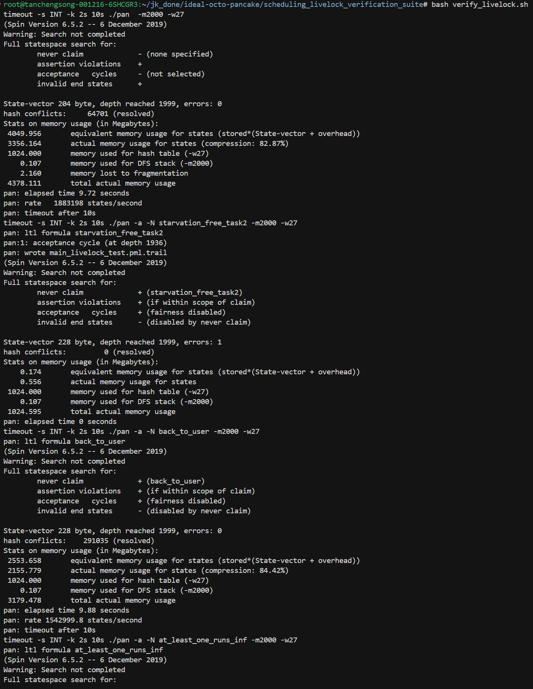
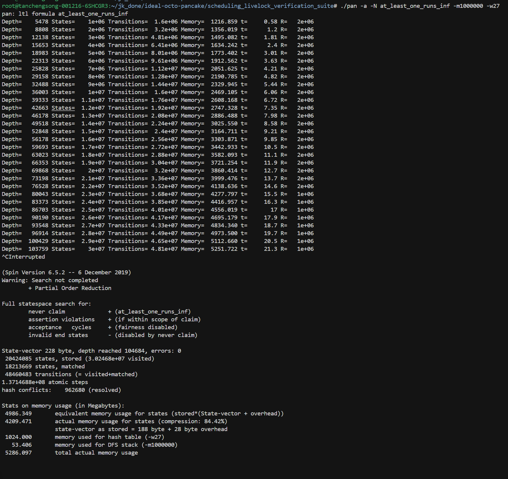

# Scheduling Livelock Verification Suite


本验证套件用于演示和检测 LiteOS-M 任务调度中的**活锁（Livelock）问题**。该问题来自并发挂起的多个中断、SysTick中断和PendSV优先级和异常数配置、以及 ARM Cortex-M 的 tail-chaining 机制的共同作用。这个潜在缺陷可能导致某些任务永远无法获得执行机会。

## 任务调度活锁问题描述

当三个并发执行的任务（`prev`、`victask`、`lucky`）在特定时序下交互时，可能发生以下情况：

1. **prev** 任务正在运行，即将被切出
2. **PendSV** 中断触发，选择 **victask** 作为下一个运行任务
3. 在 **victask** 真正开始执行之前，**SysTick** 中断通过 tail-chaining 机制触发
4. **SysTick** 再次触发 **PendSV**，导致任务重新选择
5. **victask** 失去本次执行机会，**lucky** 任务被选中

如果这种情况反复发生，**victask** 无法执行，系统不是无饿死的。如果该任务持有关键资源则可能引发系统死锁；若它是生产者/消费者模型中的关键角色，则会导致整个子系统活锁瘫痪。

## 文件结构

### 模型文件

- **`macros.pml`**: 基础宏定义（中断控制、执行条件等）
- **`data_structures.pml`**: 数据结构和队列操作
- **`scheduler.pml`**: 调度器实现
- **`ltl_properties.pml`**: LTL 性质定义（包含 starvation freedom）

### 测试场景

- **`processes_livelock_test.pml`**: 三任务场景定义
  - **PrevTask**: 位于受害者任务之前的任务
  - **VictimTask**: 受害者任务，可能失去执行机会
  - **LuckyTask**: 受益于 victask 失去机会的任务
  - **IdleTask**: 最低优先级任务，防止系统死锁

### 模型入口
我们有两个模型入口`pml`文件，用于选取不同侧重点进行验证。其中，
- **`main_livelock_test.pml`**: 活锁测试主模型
该文件包含完整的 LTL 性质定义 (`ltl_properties.pml`)，用于进行时序逻辑验证（如饥饿自由度、进度性质等），是检测活锁现象的核心模型。
- **`main_livelock_basic.pml`**: 基础验证模型
是基础验证模型，不包含ltl性质，该文件包含与主模型完全相同的逻辑组件但排除了 LTL 公式,仅仅用于验证所有断言性质成立，确保系统基本的断言（Assertion）和死锁自由（Deadlock Freedom）在无 LTL 干扰下正常。
选择分开验证断言性质和LTL性质，是因为当断言性质被违反时，验证将会自动停止，使得我们无法验证LTL性质被违反之后的其他断言的正确性。

### 验证脚本

- **`verify_livelock.sh`**: 自动化验证脚本，执行以下步骤：
  1. 编译基础模型：`spin -a main_livelock_basic.pml` 生成 `pan.c`
  2. 构建验证器：`gcc -O2 -o pan pan.c`
  3. 运行基础验证：`timeout 10s ./pan -m2000 -w27`（检查断言违规和死锁）
  4. 编译 LTL 模型：`spin -a main_livelock_test.pml` 生成 `pan.c`
  5. 构建验证器：`gcc -O2 -o pan pan.c`
  6. 验证无饥饿性质：`timeout 10s ./pan -a -N starvation_free_task2 -m2000 -w27`（预期发现 acceptance cycle）
  7. 验证进度性质：`timeout 10s ./pan -a -N back_to_user -m2000 -w27`（预期通过）
  8. 验证至少一个任务无限执行：`timeout 10s ./pan -a -N at_least_one_runs_inf -m2000 -w27`（预期通过）

**验证的四个性质：**
- **基础断言**：系统无断言违规、无死锁
- **`starvation_free_task2`**：victask 不会被饿死（预期失败，证明活锁存在）
- **`back_to_user`**：系统总会返回用户态（预期通过）
- **`at_least_one_runs_inf`**：至少有一个任务能无限执行（预期通过，说明系统未完全死锁）

运行结果截图：


## 验证方法

### 自动验证

运行验证脚本：

```bash
bash verify_livelock.sh
```

**验证内容：**
1. **基础验证**：检查断言违规
2. **饥饿自由度**：验证 victask 是否会遭受饥饿
3. **进度性质**：验证系统最终会返回用户任务

### 手动验证与预期结果

#### 1. 检查 victask 饥饿

```bash
./pan -a -N starvation_free_task2 -m2000
```

**实际输出（检测到活锁）：**

```
timeout -s INT -k 2s 10s ./pan -a -N starvation_free_task2 -m2000 -w27
pan: ltl formula starvation_free_task2
pan:1: acceptance cycle (at depth 1936)
pan: wrote main_livelock_test.pml.trail
(Spin Version 6.5.2 -- 6 December 2019)
Warning: Search not completed
Full statespace search for:
	never claim         	+ (starvation_free_task2)
	assertion violations	+ (if within scope of claim)
	acceptance   cycles 	+ (fairness disabled)
	invalid end states	- (disabled by never claim)

State-vector 228 byte, depth reached 1999, errors: 1
```

输出 `errors: 1` 和 `acceptance cycle` 表明找到了一个违反“无饥饿”性质的执行周期，即**活锁确实存在**。系统陷入了一个循环，其中 victask 虽然就绪，却无限期地得不到执行。

#### 2. 进度性质（Progress）

```bash
./pan -a -N back_to_user -m2000
```

**实际输出：**

```
timeout -s INT -k 2s 10s ./pan -a -N back_to_user -m2000 -w27
pan: ltl formula back_to_user
...
State-vector 228 byte, depth reached 1999, errors: 0
```

输出 `errors: 0` 表明系统整体仍在推进，没有彻底死锁（Hang），只是特定的任务被饿死。

## 关键验证点

### 1. 无饥饿（Starvation Freedom）

LTL 性质（`ltl_properties.pml`）：

```promela
ltl starvation_free_task2 {
    ([] (!(pending_exp > 0) || <>(EP >= FIRST_TASK))) 
    -> 
    ([] ((tcb[FIRST_TASK+1].state == READY && SysTick_pending) 
         -> <>(EP == FIRST_TASK+1)))
}
```

**含义**：如果系统会返回用户任务，那么当 victask 处于 READY 状态且有中断 pending 时，victask 最终应该被执行。

### 2. 进度性质（Progress）

```promela
ltl back_to_user {
    [] <> (EP >= FIRST_TASK)
}
```

**含义**：系统总是最终会返回用户任务（不会一直停留在异常处理）。

## 配置参数

### 搜索深度和超时

在 `verify_livelock.sh` 中调整：

```bash
DEPTH=2000   # 最大搜索深度
TIMEOUT=5    # 每个验证步骤的超时时间（秒）
```
可将depth调高，例如设置为1000000。例如，单独执行`./pan -a -N at_least_one_runs_inf -m1000000 -w27`，运行结果如下：

可以看到系统在10万步以内都无法找出`at_least_one_runs_inf`的反例，也就是说系统不会死锁。

### 任务配置

在 `processes_livelock_test.pml` 中，所有三个主任务使用**相同优先级**以触发调度竞争。

## 分析活锁轨迹

如果检测到活锁，查看生成的轨迹：

```bash
spin -t -p main_livelock_test.pml
```

### 关键观察点

1. **查找 victask 被选中但未执行的序列**：
   ```
   PendSV selects victask (EP will be FIRST_TASK+1)
   -> SysTick fires (tail-chaining)
   -> PendSV re-triggers
   -> Different task selected
   ```

2. **检查 EP 变化模式**：
   ```
   EP = 2 (prev)
   EP = 0 (PendSV)
   EP = 1 (SysTick) 
   EP = 0 (PendSV again)
   EP = 4 (lucky)  // victask (3) skipped!
   ```
