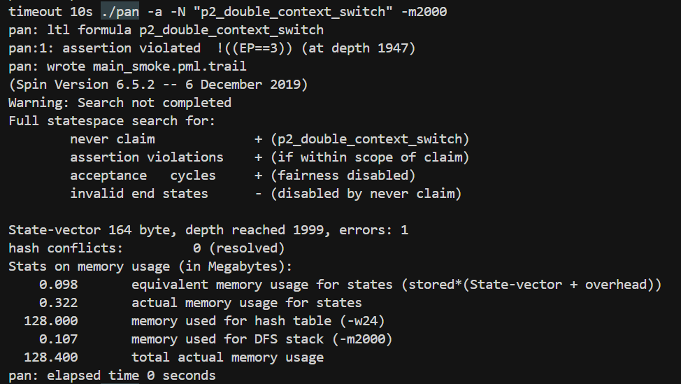

# Smoke Tests Verification Suite


本验证套件用于验证建模调度行为正确性，“试水”。模型所刻画的LiteOS-M多任务轮转调度运转无碍。`smoke-testing` （烟雾检测）是说，正常行为应当可被观测;就如同烟雾报警器被装上之前需要先检测其完好无损，否则后续的结果都可能是误报错报。

所有验证需要文档、代码均在本目录（`smoke_tests_verification_suite/`）中

## 运行

```bash
bash verify_smoke.sh
```
以上命令运行我们用于`smoke-testing`套件的所有验证用例。脚本会将编译信息等冗余内容去掉，保留核心结果。每个验证用例开头都会打印出形如
```
timeout 10s ./pan -a -N "smoke_P1_user_no_pending" -m2000
```
的验证命令，可复制用于运行单个性质验证。

## 测试内容

**Smoke Tests** (2个，应失败=正常)
- 针对所有任务，验证正常运行且没有中断挂起的状态存在。这两个验证用例涉及的规约性质分别为`smoke_P1_user_no_pending`和`smoke_P2_user_no_pending`。以`smoke_P1_user_no_pending`为例，其验证结果截图如下：

其对应LTL公式位于本文件夹下的`ltl_properties.ltl`，内容为：
```
ltl smoke_P1_user_no_pending {
  [] !(
     (
        /* 前置步骤: P1在用户态执行，没有pending */
        (EP==(FIRST_TASK) && pending_exp==0 && chain_tick_used==1)
    )
  )
}
```
这个公式说，任意时刻都不存在这样的状态，`EP == FIRST_TASK`、`pending_exp == 0`和`chain_tick_used==1`被同时满足。这三个性质同时满足意味着：任务一处于运行中，且此刻没有硬件中断挂起，也没有硬件中断挂起到一半、还未退出的残留变量状态置位。这个状态是常规用户态，应该是可达的。令此状态对应的公式为`P`，LTL公式`[] !(P)`被违反则意味着`P`代表的状态是可达的。通过对`P`取反然后添加恒真表达式`[]`，即可做可达性验证。SPIN会遍历所有状态，找出`P`可能为真的场景。可以看到，这样的场景确实被找到了，途中`assertion violated.....`和`errors: 1`即说明了这一点。若要观察到达这一点的详细轨迹，可运行
```
timeout 10s ./pan -a -N "smoke_P1_user_no_pending" -m2000
```
后，再运行
```
spin -t -p -g -l main_smoke.pml
```
来生成从初始状态开始后，到`P`为真时，每一步的变量变化情况。

**用户态、异常态、用户态来回切换轨迹** (2个，应通过)
- 验证不存在非法的“空转切换”序列。这两个测试（`p2_double_context_switch` 和 `P2_switching_not_P1_witness_unfolded`）使用`NEVER`断言来排除特定的异常调度路径。
这两个断言性质的定义分别为：
```pml
ltl p2_double_context_switch {
  NEVER(
    EVENTUALLY_THEN(
        IN_USER_STATE(3) && SYSTICK_INT,          /* P2执行，SysTick来 */
        THEN(IN_SYSTICK(3),                 /* 进入SysTick */
        THEN(IN_PENDSV(3),                  /* PendSV，栈=P2 */
        THEN(IN_PENDSV(2),                  /* 切到P1 */
        THEN(IN_SYSTICK(2),                 /* 第二次SysTick */
        THEN(IN_PENDSV(2),                  /* PendSV，栈=P1 */
        THEN(IN_PENDSV(3),                  /* 切回P2 */
             IN_USER_STATE(3)                     /* 返回P2 */
        ))))))
    )
  )
}
```
和
```pml
ltl P2_switching_not_P1_witness_unfolded {
  [] !(
    <> (
        /* 步骤1: P2被SysTick打断，进入SysTick Handler */
        (EP==SysTick_ID && EP_Stack==(FIRST_TASK+1))
        && (
            (EP==SysTick_ID && EP_Stack==(FIRST_TASK+1))
            U
            (
                /* 步骤2: tail-chain到PendSV，仍然栈是P2 */
                (EP==PendSV_ID && EP_Stack==(FIRST_TASK+1))
                && (
                    /* ... (中间省略大量嵌套 U 操作) ... */
                    (EP==PendSV_ID && EP_Stack==(FIRST_TASK+1))
                    U
                    (
                        /* 步骤7: 最终返回P2用户态 */
                        (EP==(FIRST_TASK+1))
                    )
                )
            )
        )
    )
  )
}
```
可以看到 `p2_double_context_switch` 是 `P2_switching_not_P1_witness_unfolded` 的语法糖版本，能更清楚地展现发生的事件。
- **P2→P1→P2 双重切换序列 (`p2_double_context_switch`)**: 这个性质验证系统不会出现“P2切向P1，但在P1执行任何用户代码前又立即被中断切回P2”的情况。如果发生了这种情况（即验证失败），说明系统在异常处理中潜在可能发生不必要的乒乓效应，而没有真正执行任务。两个测试通过（`errors: 0`）则表明这些不良轨迹不存在。

实际验证过程发现这两个断言性质被证伪，从而引导我们发现系统有潜在的风险发生活锁。具体细节参见`livelock`相关验证套件。


**基本性质** (2个，应通过)
- 验证系统的活性（Liveness）和基本正确性。
- **异常最终返回用户态 (`back_to_user`, `exc_leads_to_user`)**: 这两个性质断言系统不会永久停留在异常处理状态。
  ```pml
  ltl back_to_user { [] <> IN_USER }
  ltl exc_leads_to_user { [] (IN_EXC -> <> IN_USER) }
  ```
  公式`[] <> IN_USER`表示“在任意执行路径上，系统总是会（无限次）回到用户态”。这是实时操作系统的基本要求：中断必须结束，控制权必须交还给用户任务。这两个测试**应通过**。
  
实际验证中，二者通过。

### 模型入口
我们有一个核心模型入口 `main_smoke.pml`，该文件包含全部的 LTL 性质定义 (`ltl_properties.ltl`)，用于进行时序逻辑验证，是验证套件的核心模型。选择分开验证断言性质和LTL性质，是因为当断言性质被违反时，验证将会自动停止，使得我们无法验证LTL性质被违反之后的其他断言的正确性。

## 配置

编辑 `verify_smoke.sh` 可调整搜索参数：
```bash
DEPTH=2000   # 状态空间搜索深度
TIMEOUT=10   # 单个验证超时时间(秒)
```
